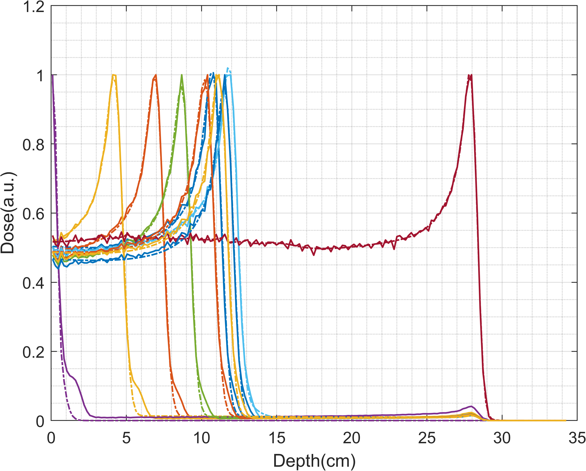
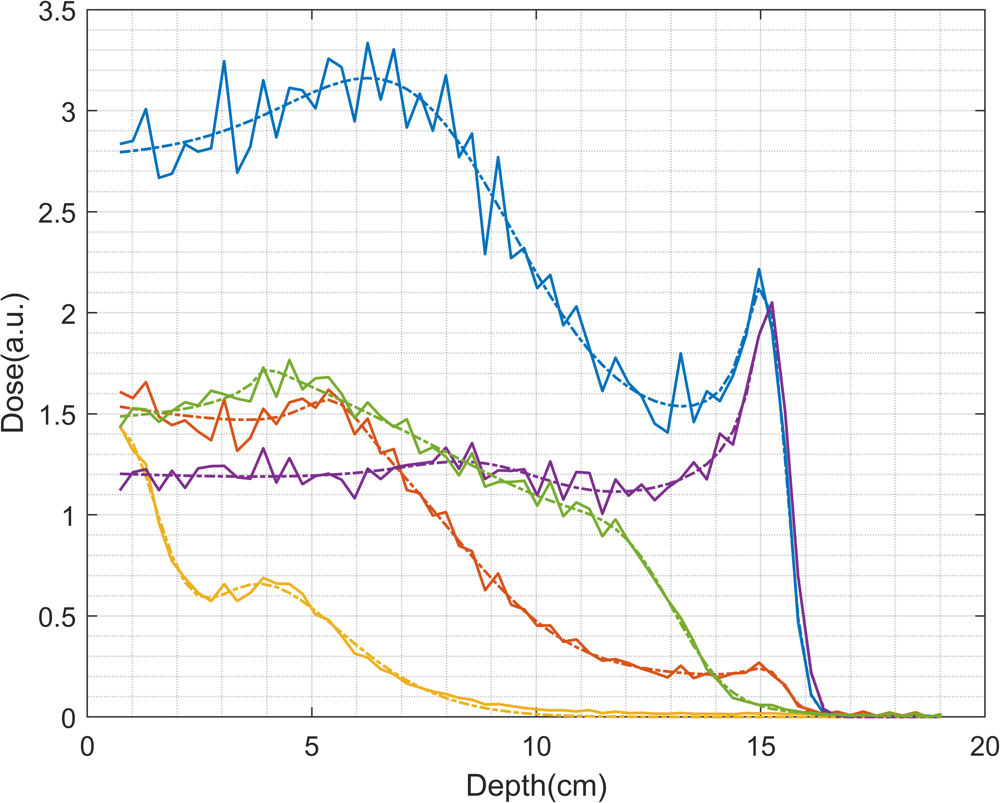

# Proton Bragg Peak Fit
[](https://www.mathworks.com/matlabcentral/fileexchange/100516-fit-proton-bragg-peaks)

- Provide 3 different IDD measurement data, data acquired from Zebra and other MLIC which can be used in Proton Radiographics
- Bortfeld function implemented in C++, provide IDD, mean gradient and jacobian outputs.
- Input Integral Depth Dose(IDD) is suggested to rescale to [0,10] or nomalize to [0,1], but it's ok to fit raw data in any scale
- Compiled with Visual Studio + Intel OneAPI, faster than mex in MATLAB. Highly recommanded to compile the src with VS and Intel OneAPI
- Support Apple Silicon (Matlab R2022a, Matlab R2022a beta don't have toolboxs)
- Image Processing Toolbox, Optimization Toolbox and Signal Processing Toolbox required

Remark:
M1 mac openmp issue: https://www.mathworks.com/matlabcentral/answers/1761950-m1-mac-compile-mex-file-with-openmp?s_tid=srchtitle

Matlab R2022a thread safty is not very stable, if the mex function crashed matlab, run the magic function 'test3_mex.mexmaci64' by calling `test3_mex(int32(16));`. Its output looks like
```
i = 1 
i = 2 
i = 7 
i = 8 
i = 5 
i = 6 
i = 3 
i = 4 
i = 9 
i = 10 
i = 13 
i = 11 
i = 14 
i = 15 
i = 12 
i = 16 
```
Matlab R2022a beta works well with openmp but it do not support official toolbox.

How to use:  
- If your can run the first statement in Windows, do nothing. If you can't, run ./src/compile.m
- `output = bf_mex((1:64)*0.3,[15,0.3,1e-3,0.4, 12,0.4,1e-3,0.4],'idd')`
- `[x,idd_o] = precise_fit(z,idd_i,num_bp,strict);`
- `x = fast_fit(z,idd_i,num_bp);`

Details can be found in demo.m, column 1D array is prefered such as, zeros(n,1)

Zebra data:



Multi-Bragg Peaks Fit:



It take 160s to fit 11057 IDD curves with 2 bragg peak model @i9-9900k

It take 120s to fit 10498 IDD curves with 2 bragg peak model @i9-9900k

Brief introduction (formula will be displayed in github : https://github.com/civerjia/Proton-Bragg-Peak-Fit):

Bortfeld function is an analytical approximation of the Bragg curve for therapeutic proton beams, given by

$$
\begin{align}
D(z) \approx 
\begin{cases}
\hat{D}(z) \;\;z < R_0 - 10\sigma\\
D(z) \;\; R_0 - 10\sigma\le z\le R_0+5\sigma \\
0 \;\; otherwise
\end{cases}
\end{align}
$$

z denotes the depth in cm. there are 4 parameters in bortfeld funtion $R_0, \sigma, \epsilon, \Phi_0$ and we can guess a initial points from the table provided by bortfeld.
```
z = (1:64)*0.291; % depth in cm
[vmax,idx] = maxk(idd,k);
R0 = z(idx);% Range
alpha = 0.0022;
p = 1.77;
E0 = (R0./alpha).^(1/p);% estimated proton energy
sigma = sqrt((0.012.*R0.^0.935).^2 + (0.01.*E0).^2.*(alpha.*p.*E0.^(p-1)).^2);
epsilon = 1e-3;
Phi = zv.*zr.*epsilon;
```
or use the simple version
```
R0 = z(idx);% Range
sigma = 0.07*zr;
epsilon = 1e-3;
Phi = zv.*zr.*1e-2;
```
The depth-dose distribution in water is given by $\hat D_{H_2O}(z)$ and $D_{H_2O}(z)$:

$$
\begin{align}
\hat D_{H_2O}(z) &= \frac{\Phi_0}{1+0.012R_0}\left[17.93(R_0-z)^{-0.435}+\left(0.444+31.7\frac{\epsilon}{R_0}\right)(R_0-z)^{0.565} \right]\\
D_{H_2O}(z) &= \Phi_0\frac{e^{-\frac{(R_0-z)^2}{4\sigma^2}}\sigma^{0.565}}{1+0.012R_0} \left[11.26\frac{\mathfrak{D}(-0.565,-\frac{R_0-z}{\sigma})}{\sigma}+ \left(0.157+11.26\frac{\epsilon}{R_0}\right) \mathfrak{D}(-1.565,-\frac{R_0-z}{\sigma})\right]\\
\end{align}
$$

$\mathfrak{D}(a,x)$, is a [parabolic cylinder function](https://mathworld.wolfram.com/ParabolicCylinderFunction.html) defined in Eq.33 We can get $\mathfrak{D}(a,x)=\mathit{U}(-a-0.5,x)$, this function is defined in https://github.com/civerjia/Parabolic-Cylinder-Functions-C-

Parameters of a single bortfeld function is a 4-element 1d array, $[R_0,\sigma,\epsilon,\Phi_0]$,  n-bortfeld function is a $4n$ 1d array,$[R_1,\sigma_1,\epsilon_1,\Phi_1,R_2,\sigma_2,\epsilon_2,\Phi_2,\cdots,R_n,\sigma_n,\epsilon_n,\Phi_n]$.

Gradients:

$$
\begin{align}
\frac{\partial\hat D}{\partial R_0} &= 
\frac{\Phi_0 \left(-\frac{31.7 \epsilon (R_0-z)^{0.565}}{R_0^2}+\frac{0.565 \left(\frac{31.7 \epsilon}{R_0}+0.444\right)}{(R_0-z)^{0.435}}-\frac{7.79955}{(R_0-z)^{1.435}}\right)}{0.012 R_0+1}\\
&-\frac{0.012 \Phi_0 \left(\left(\frac{31.7 \epsilon}{R_0}+0.444\right) (R_0-z)^{0.565}+\frac{17.93}{(R_0-z)^{0.435}}\right)}{(0.012 R_0+1)^2}
\\
\frac{\partial\hat D}{\partial \epsilon} &= \frac{31.7 \Phi_0 (R_0-z)^{0.565}}{(0.012 R_0+1) R_0}
\\
\frac{\partial D}{\partial \epsilon} &= 
\frac{11.26 \Phi_0 \sigma^{0.565} e^{-\frac{(R_0-z)^2}{4 \sigma^2}} f\left(\frac{z-R_0}{\sigma},-1.565\right)}{(0.012 R_0+1) R_0}
\\
\frac{\partial D}{\partial \sigma} &=
\frac{\Phi_0 \sigma^{0.565} e^{-\frac{(R_0-z)^2}{4 \sigma^2}} \left(-\frac{(z-R_0) \left(\frac{11.26 \epsilon }{R_0}+0.157\right) f^{(1,0)}\left(\frac{z-R_0}{\sigma},-1.565\right)}{\sigma^2}-\frac{11.26 (z-R_0) f^{(1,0)}\left(\frac{z-R_0}{\sigma},-0.565\right)}{\sigma^3}-\frac{11.26 f\left(\frac{z-R_0}{\sigma},-0.565\right)}{\sigma^2}\right)}{0.012 R_0+1}\\
&+\frac{0.565 \Phi_0 e^{-\frac{(R_0-z)^2}{4 \sigma^2}} \left(\left(\frac{11.26 \epsilon }{R_0}+0.157\right) f\left(\frac{z-R_0}{\sigma},-1.565\right)+\frac{11.26 f\left(\frac{z-R_0}{\sigma},-0.565\right)}{\sigma}\right)}{(0.012 R_0+1) \sigma^{0.435}}\\
&+\frac{\Phi_0 (R_0-z)^2 e^{-\frac{(R_0-z)^2}{4 \sigma^2}} \left(\left(\frac{11.26 \epsilon }{R_0}+0.157\right) f\left(\frac{z-R_0}{\sigma},-1.565\right)+\frac{11.26 f\left(\frac{z-R_0}{\sigma},-0.565\right)}{\sigma}\right)}{2 (0.012 R_0+1) \sigma^{2.435}}
\\
\end{align}
$$


$$
\begin{align}
\frac{\partial D}{\partial R_0} &=
\frac{\Phi_0 \sigma^{0.565} e^{-\frac{(R_0-z)^2}{4 \sigma^2}} \left(-\frac{11.26 f^{(1,0)}\left(\frac{z-R_0}{\sigma},-0.565\right)}{\sigma^2}-\frac{\left(\frac{11.26 \epsilon }{R_0}+0.157\right) f^{(1,0)}\left(\frac{z-R_0}{\sigma},-1.565\right)}{\sigma}-\frac{11.26 \epsilon  f\left(\frac{z-R_0}{\sigma},-1.565\right)}{R_0^2}\right)}{0.012 R_0+1}\\
&+\frac{0.012 (-1) \Phi_0 \sigma^{0.565} e^{-\frac{(R_0-z)^2}{4 \sigma^2}} \left(\left(\frac{11.26 \epsilon }{R_0}+0.157\right) f\left(\frac{z-R_0}{\sigma},-1.565\right)+\frac{11.26 f\left(\frac{z-R_0}{\sigma},-0.565\right)}{\sigma}\right)}{(0.012 R_0+1)^2}\\
&-\frac{\Phi_0 (R_0-z) e^{-\frac{(R_0-z)^2}{4 \sigma^2}} \left(\left(\frac{11.26 \epsilon }{R_0}+0.157\right) f\left(\frac{z-R_0}{\sigma},-1.565\right)+\frac{11.26 f\left(\frac{z-R_0}{\sigma},-0.565\right)}{\sigma}\right)}{2 (0.012 R_0+1) \sigma^{1.435}}
\\
\end{align}
$$

Reference :
- An analytical approximation of the Bragg curve for therapeutic proton beams
- E. Cojocaru. Parabolic Cylinder Functions (https://www.mathworks.com/matlabcentral/fileexchange/22620-parabolic-cylinder-functions)

