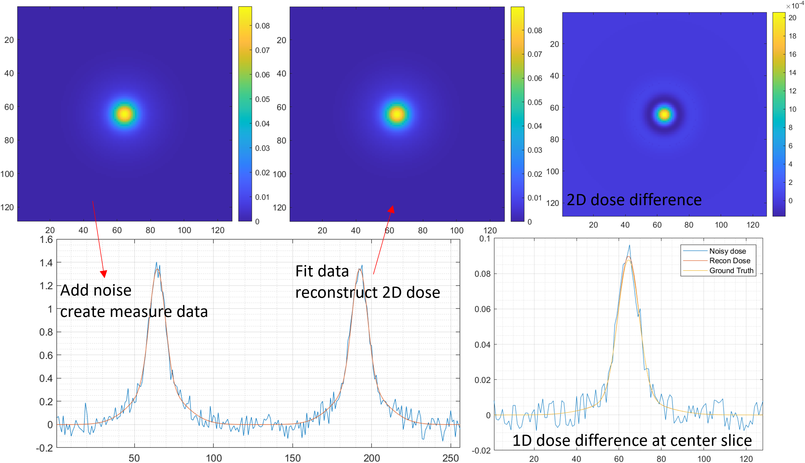
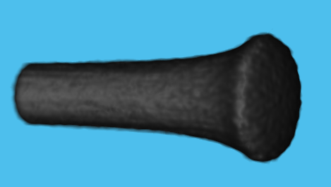
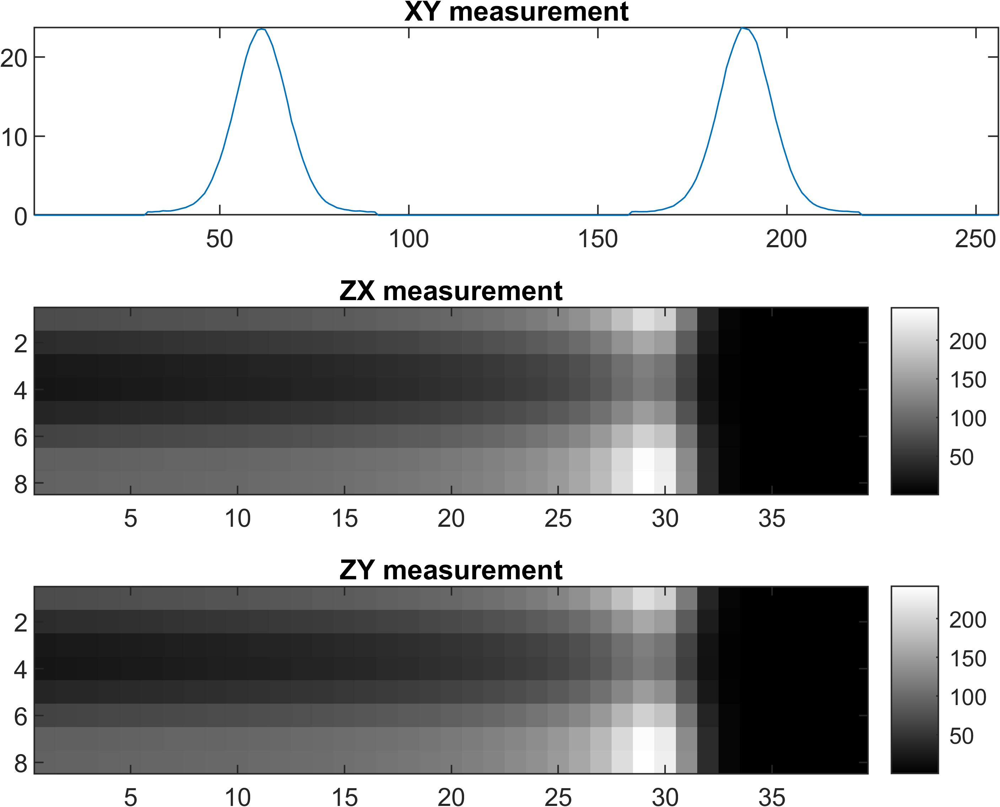
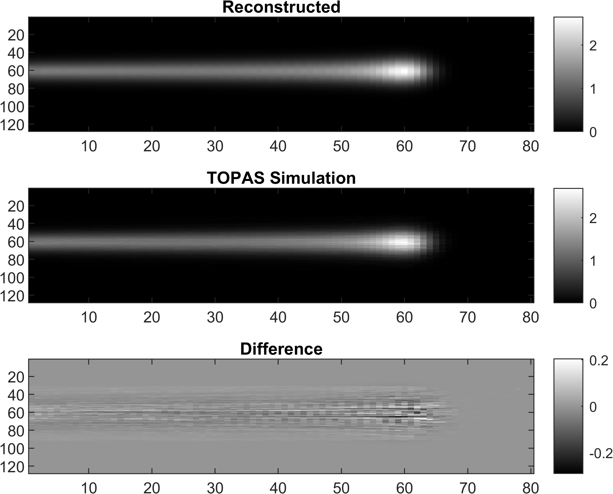
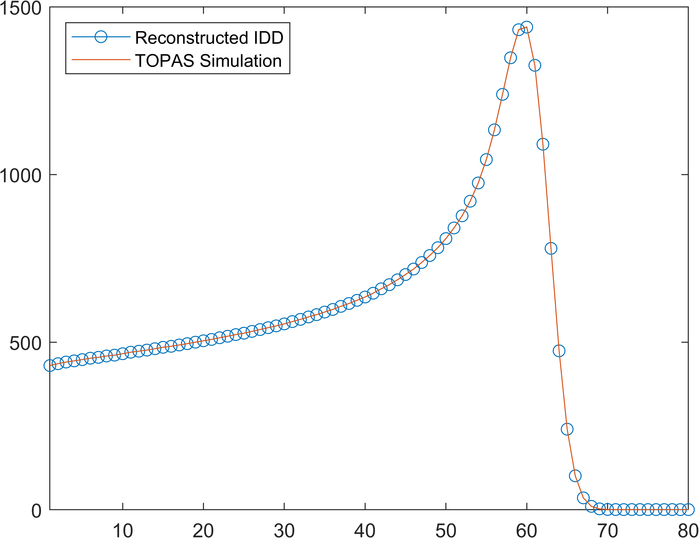
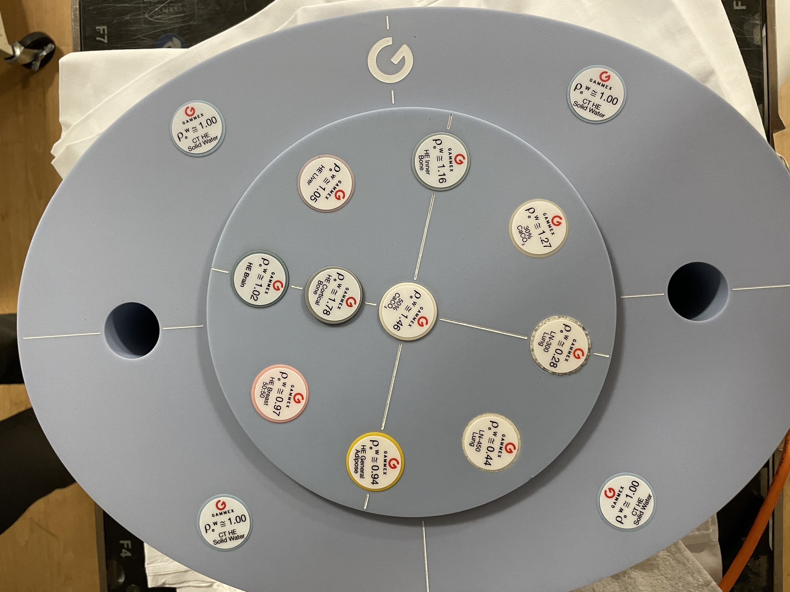
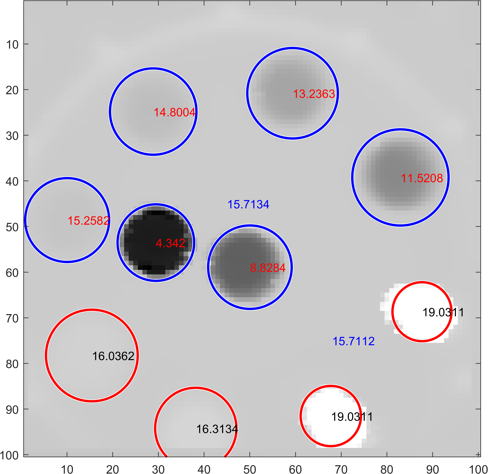
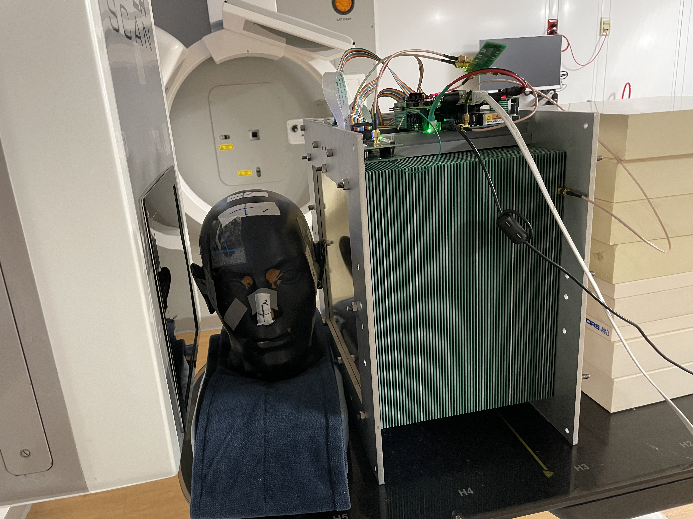
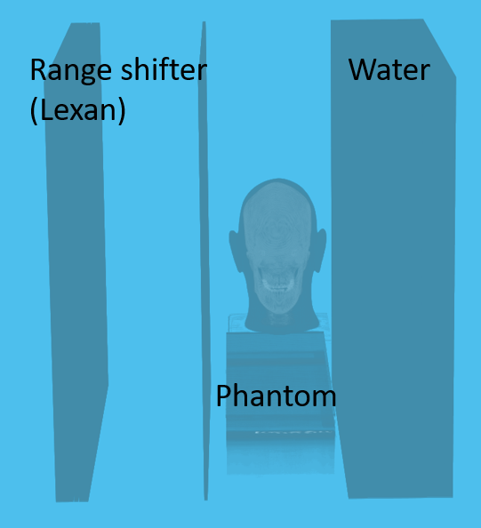
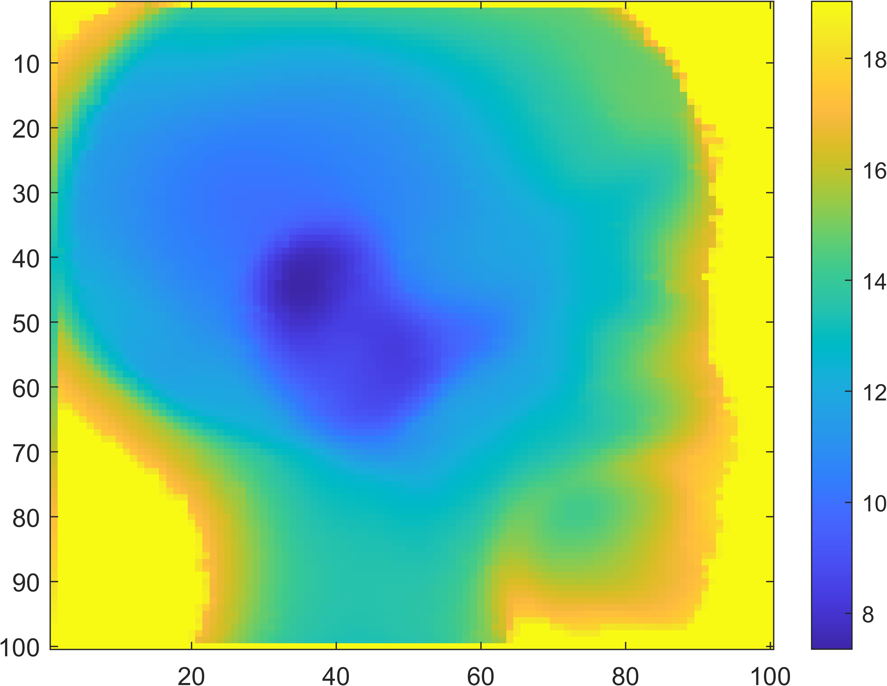

# Proton Bragg Peak Fit
[](https://www.mathworks.com/matlabcentral/fileexchange/100516-fit-proton-bragg-peaks)

# Feature
1. Fit IDD curve with Bortfeld functions, IDD curve may contains multiple bragg peaks.
2. Reconstruct 2D/3D proton dose from measurement of MLSIC<sup>[5]</sup>, (multi-gauss model in XY plane, bortfeld in Z)
3. Proton Radiography/CT with feature 1 and 2

---
- Provide IDD measurement data and simulation data, data acquired from Zebra and other MLIC which can be used in Proton Radiographics
- Bortfeld function implemented in C++, provide IDD, mean gradient and jacobian outputs.
- Input Integral Depth Dose(IDD) is suggested to rescale to [0,10] or nomalize to [0,1], but it's ok to fit raw data in any scale
- Compiled with Visual Studio + Intel OneAPI, faster than mex in MATLAB. Highly recommanded to compile the src with VS and Intel OneAPI
- Support Apple Silicon (Matlab R2022a, Matlab R2022a beta don't have toolboxs)
- Image Processing Toolbox, Optimization Toolbox and Signal Processing Toolbox required

# Upgrading, don't clone right now

# How to use:  
## Windows
- Pre-compiled functions are provided.
    - `BortfeldFunction.mexw64` Windows with avx2(supported by most of modern x86_64 CPU).
- If Pre-compiled functions not work, run `./src/compile_PBPF.m` to compile it
## MacOS
- Pre-compiled functions are provided.
    - `BortfeldFunction.mexmaca64` for Apple Silicon Mac (do not Support AVX)
    - `BortfeldFunction.mexmacai64` for Intel Mac (AVX not used) 
- If Pre-compiled functions not work, run `./src/compile_PBPF.m` to compile it
## Linux 
- Pre-compiled functions are **Not** provided.
    - `BortfeldFunction_avx512f.mexa64` Linux with avx512f (Only some x86_64 CPU support this) **If you use this, change BortfeldFunction in bf_mex to BortfeldFunction_avx512f**
    - `BortfeldFunction.mexa64` Linux with avx2(supported by most of modern x86_64 CPU)
- If Pre-compiled functions not work, run `./src/compile_PBPF.m` to compile it
## Compilation
- All precompiled mex function can work with both `single` and `double`, but `single` numbers can **not be used for finite difference** optimization(double precision required). Use the gradient provided by mex function.
- Open the root folder run `cd('./src')` in matlab
- run `compile_PBPF` three compile flags are provided
    - use_openmp = 1; Use OpenMP
    - use_avx = 1;    Use AVX2
    - is_avx512 = 1;  Use AVX512 (not every CPU support this)
## Here are some code snippets
- predict IDD with depth and bf parameters
```matlab
z = (1:64)*0.3; % depth unit(cm), (n,1) size is preferred
% bortfeld function parameters, [range1,sigma1,epsilon1,phi1, range2,sigma2,epsilon2,phi2] two bragg-peaks used here, range unit is cm
bf_para = [15,0.3,1e-3,0.4, 12,0.4,1e-3,0.4];
% get idd curve, size of output will be (n,1), no matter z is (1,n) or (n,1)
output = bf_mex(z,bf_para,'idd');
plot(z,output);
grid on;
grid minor;
xlabel('Depth(cm)');
ylabel('Dose(a.u.)');% a.u. means arbitary unit
% for short
% output = bf_mex((1:64)*0.3,[15,0.3,1e-3,0.4, 12,0.4,1e-3,0.4],'idd')
```
- Fit measured IDD
```matlab
% method 1
[x,idd_o] = precise_fit(z,idd_i,num_bp,strict);
% method 2 used for fast fit, don't calculate IDD in this function
x = fast_fit(z,idd_i,num_bp);
idd_o = bf_mex(z,x,'idd');
```
- Get gradient (Jacobian matrix) of Bortfeld function
```matlab
z = (1:64)*0.3; % depth unit(cm), (n,1) size is preferred
% bortfeld function parameters, (m,1), range unit is cm
bf_para = [15,0.3,1e-3,0.4, 12,0.4,1e-3,0.4];
% output size will be (n,m)
output = bf_mex((1:64)'*0.3,[15,0.3,1e-3,0.4, 12,0.4,1e-3,0.4],'jacobian')
```
- Other functions
  - stored in `./utils/`
  - If matlab crashed on Rosseta Matlab, run this function `ifMacCrashed()`
- Benchmark of mex functions `./utils/test_mex_func.m`, further optimization required.
```matlab
% BortfeldFunction time: single(0.249554s), double(0.248533s)
% BortfeldFunction Grad time: single(2.758517s), double(2.772066s)
% Gauss2D Grad GPU time: single(0.942952s), double(1.575574s)
% Gauss2D Grad CPU time: single(0.131198s), double(0.201214s)
% Gauss2D GPU time: single(0.196284s), double(0.450232s)
% Gauss2D CPU time: single(0.842755s), double(0.665228s)
% ProtonDose3D GPU time: single(0.493263s), double(0.537123s)
% ProtonDose3D CPU time: single(0.751850s), double(0.496489s)
```

## 1D IDD data
Applications can be found in `./utils/demo.m` and data stored in `./data/`. Be careful, run the demo section by section, some parts are time comsuming.


<div align="center">

Zebra data            |  other MLIC data
:-------------------------:|:-------------------------:
||   |
</div>

## 2D dose reconstruction
Strip ionization chamber array[4,5] were used for QA purpose, two layers of horizontal and vertical strip detectors were used to locate the proton beam position.[Details](./details.md)
<p align="center">

</p>
<center>

| White Noise level(divide by max dose)      | Max Absolute Error( $\frac{\max\|error\|}{max[dose]}$) |
| ----------- | ----------- |
| 30%   |0.0441|
| 20%      | 0.0337      |
| 10%   | 0.0192        |

</center>

## 3D dose reconstruction
Only MLSIC can measure a 3D dose in real time[5], it contains 768 ADC channels (XY: 128x2, ZX: 8x32, ZY: 8x32) [Details](./details.md). The measurement function of MLSIC can be defined as a function,
$f: \R^{128\times128\times66} \rightarrow \R^{128\times2 + 8\times32 + 8\times32}$  

### Symmetric dose

<div align="center">

3D Dose            |  MLSIC measurement
:-------------------------:|:-------------------------:
||   |
</div>

<div align="center">

Central Slice Dose            |  IDD
:-------------------------:|:-------------------------:
||   |
</div>

### Asymetric dose
to be updated

## Proton Radiography
<div align="center">

Gammex Phantom            |  MLSIC data
:-------------------------:|:-------------------------:
||   |
</div>

Head Phantom |     Simulation      |  MLSIC data
:-------------------------:|:-------------------------:|:-------------------------:
||   |   |
</div>

## Proton CT
to be updated

# Details of math and MLSIC structures can be found in [here](./details.md)


# Reference :
1. [An analytical approximation of the Bragg curve for therapeutic proton beams](https://aapm.onlinelibrary.wiley.com/doi/abs/10.1118/1.598116)
2. [E. Cojocaru. Parabolic Cylinder Functions](https://www.mathworks.com/matlabcentral/fileexchange/22620-parabolic-cylinder-functions)
3. [On the parametrization of lateral dose profiles in proton radiation therapy](https://cds.cern.ch/record/2115400/files/Varenna-2015-339.pdf)
4. [A 2D strip ionization chamber array with high spatiotemporal resolution for proton pencil beam scanning FLASH radiotherapy](https://aapm.onlinelibrary.wiley.com/doi/10.1002/mp.15706)
5. [A multi-layer strip ionization chamber (MLSIC) device for proton pencil beam scan quality assurance](https://pubmed.ncbi.nlm.nih.gov/35905730/)
6. [Evaluation of the influence of double and triple Gaussian proton kernel models on accuracy of dose calculations for spot scanning technique](https://pubmed.ncbi.nlm.nih.gov/26936728/)


# Remark:
M1 mac openmp issue: https://www.mathworks.com/matlabcentral/answers/1761950-m1-mac-compile-mex-file-with-openmp?s_tid=srchtitle

Matlab R2022a thread safty is not very stable, if the mex function crashed matlab, run the magic function 'test3_mex.mexmaci64' by calling `test3_mex(int32(16));`. Its output looks like
```
i = 1 
i = 2 
i = 7 
i = 8 
i = 5 
i = 6 
i = 3 
i = 4 
i = 9 
i = 10 
i = 13 
i = 11 
i = 14 
i = 15 
i = 12 
i = 16 
```
Matlab R2022a beta works well with openmp but it do not support official toolbox.
