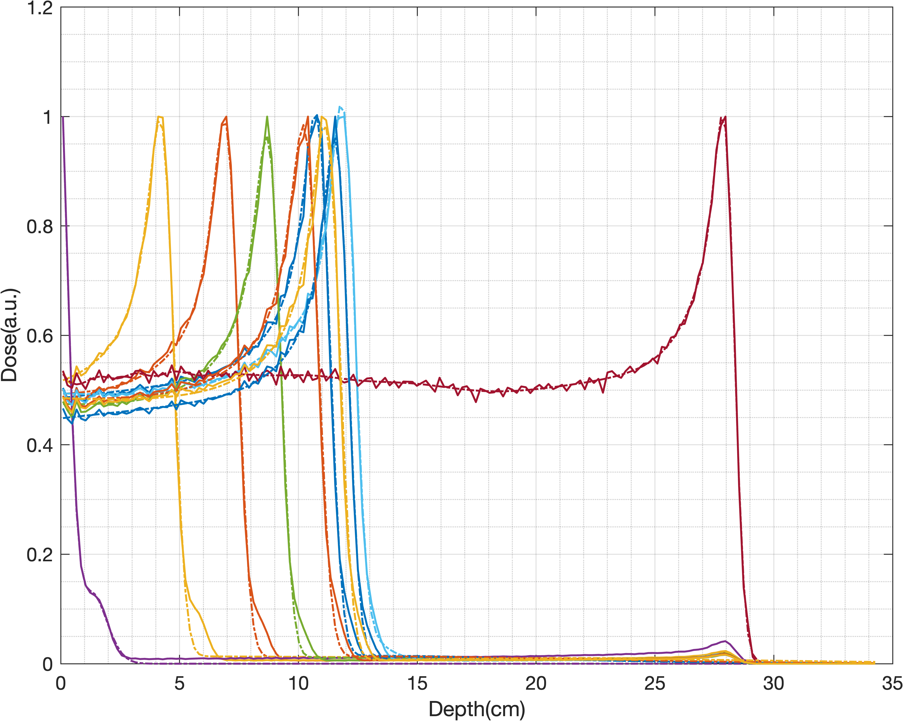
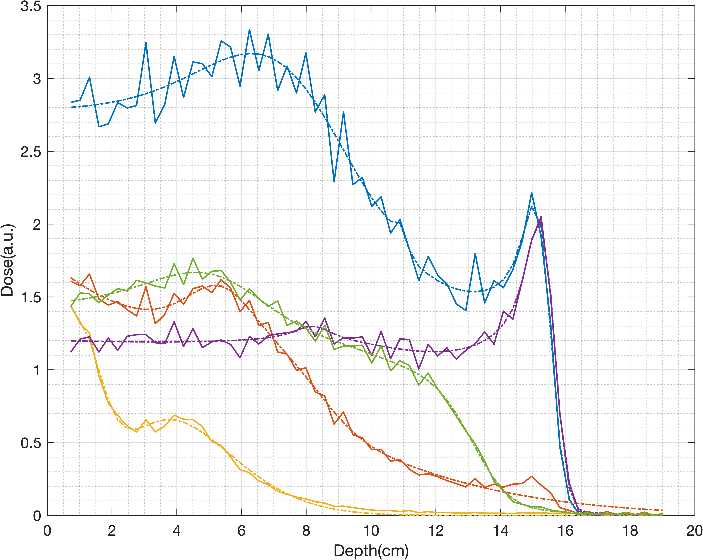
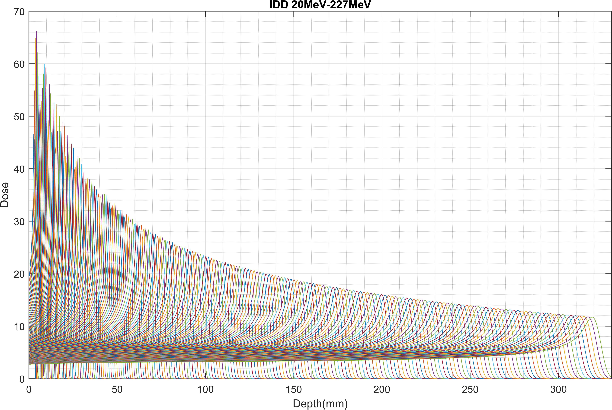
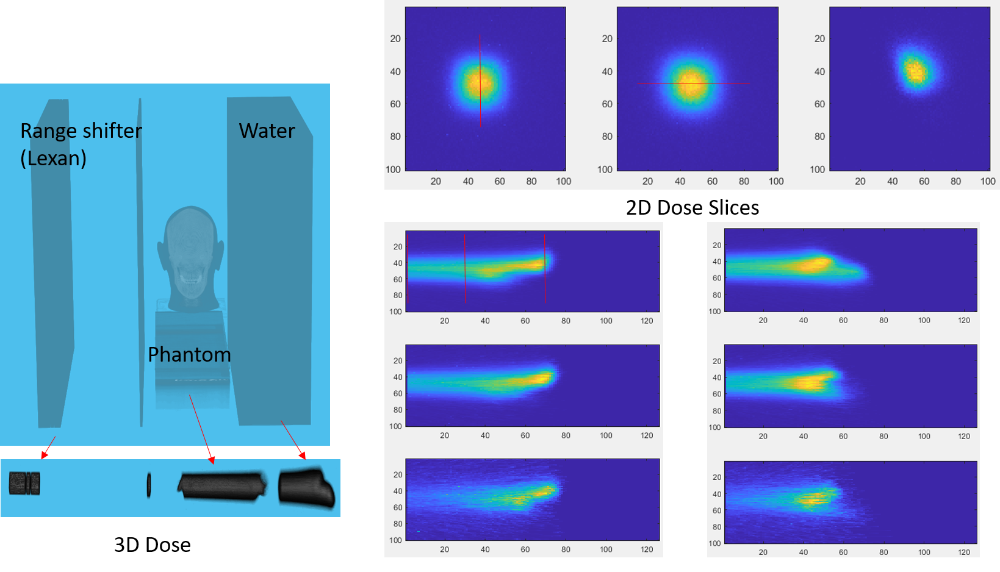
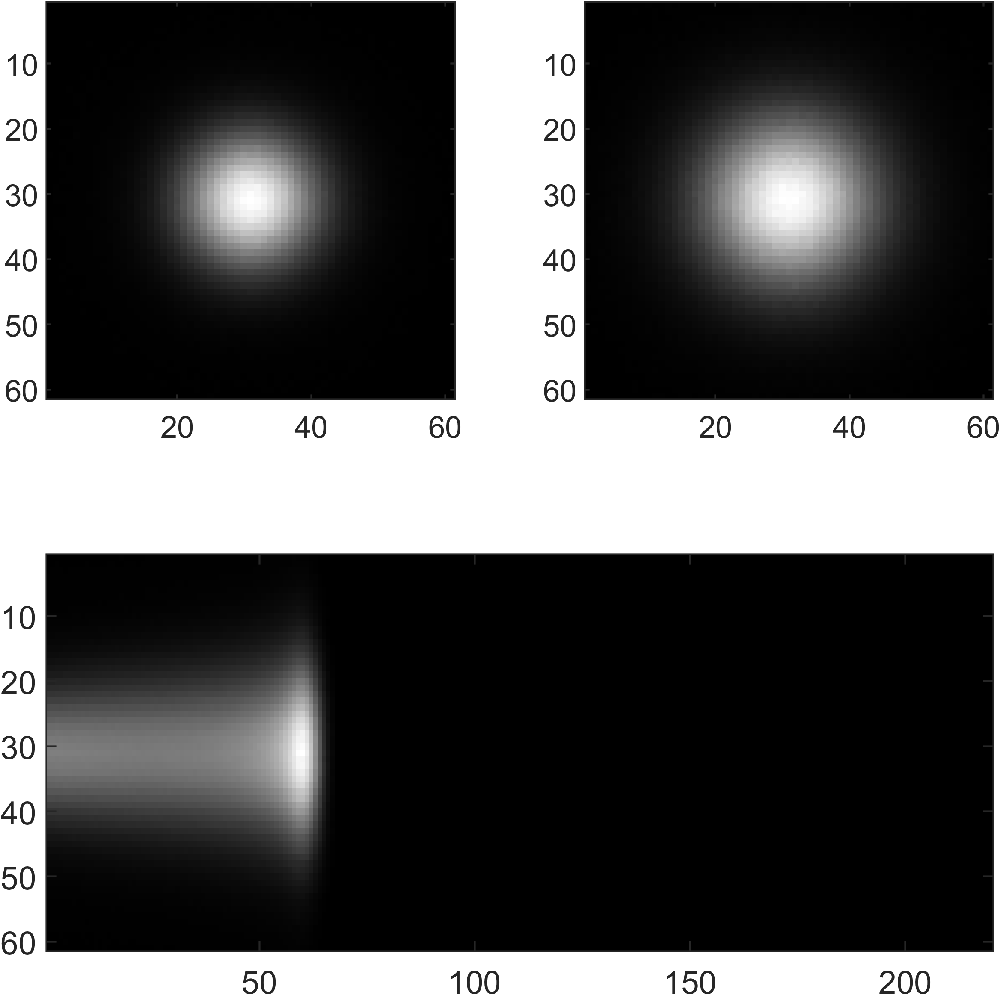

# Proton Bragg Peak Fit
[](https://www.mathworks.com/matlabcentral/fileexchange/100516-fit-proton-bragg-peaks)

- Provide IDD measurement data and simulation data, data acquired from Zebra and other MLIC which can be used in Proton Radiographics
- Bortfeld function implemented in C++, provide IDD, mean gradient and jacobian outputs.
- Input Integral Depth Dose(IDD) is suggested to rescale to [0,10] or nomalize to [0,1], but it's ok to fit raw data in any scale
- Compiled with Visual Studio + Intel OneAPI, faster than mex in MATLAB. Highly recommanded to compile the src with VS and Intel OneAPI
- Support Apple Silicon (Matlab R2022a, Matlab R2022a beta don't have toolboxs)
- Image Processing Toolbox, Optimization Toolbox and Signal Processing Toolbox required

# Upgrading, don't clone right now

# How to use:  
## windows
- Pre-compiled functions are provided.
    - `BortfeldFunction.mexw64` Windows with avx2(supported by most of modern x86_64 CPU).
- If Pre-compiled functions not work, run `./src/compile_PBPF.m` to compile it

## Linux and MacOS
- Pre-compiled functions are provided.
    - `BortfeldFunction_avx512f.mexa64` Linux with avx512f (Only some x86_64 CPU support this) **If you use this, change BortfeldFunction in bf_mex to BortfeldFunction_avx512f**
    - `BortfeldFunction.mexa64` Linux with avx2(supported by most of modern x86_64 CPU)
    - `BortfeldFunction.mexmaca64` for Apple Silicon Mac (do not Support AVX)
    - `BortfeldFunction.mexmacai64` for Intel Mac (AVX not used) 
- If Pre-compiled functions not work, run `./src/compile_PBPF.m` to compile it
## Compilation
- Open the root folder run `cd('./src')` in matlab
- run `compile_PBPF` three compile flags are provided
    - use_openmp = 1; Use OpenMP
    - use_avx = 1;    Use AVX2
    - is_avx512 = 1;  Use AVX512 (not every CPU support this)
## Here are some code snippets
- predict IDD with depth and bf parameters
```matlab
z = (1:64)*0.3; % depth unit(cm), (n,1) size is preferred
% bortfeld function parameters, [range1,sigma1,epsilon1,phi1, range2,sigma2,epsilon2,phi2] two bragg-peaks used here, range unit is cm
bf_para = [15,0.3,1e-3,0.4, 12,0.4,1e-3,0.4];
% get idd curve, size of output will be (n,1), no matter z is (1,n) or (n,1)
output = bf_mex(z,bf_para,'idd');
plot(z,output);
grid on;
grid minor;
xlabel('Depth(cm)');
ylabel('Dose(a.u.)');% a.u. means arbitary unit
% for short
% output = bf_mex((1:64)*0.3,[15,0.3,1e-3,0.4, 12,0.4,1e-3,0.4],'idd')
```
- Fit measured IDD
```matlab
% method 1
[x,idd_o] = precise_fit(z,idd_i,num_bp,strict);
% method 2 used for fast fit, don't calculate IDD in this function
x = fast_fit(z,idd_i,num_bp);
idd_o = bf_mex(z,x,'idd');
```
- Get gradient (Jacobian matrix) of Bortfeld function
```matlab
z = (1:64)*0.3; % depth unit(cm), (n,1) size is preferred
% bortfeld function parameters, (m,1), range unit is cm
bf_para = [15,0.3,1e-3,0.4, 12,0.4,1e-3,0.4];
% output size will be (n,m)
output = bf_mex((1:64)'*0.3,[15,0.3,1e-3,0.4, 12,0.4,1e-3,0.4],'jacobian')
```
- Test BortfeldFunction
```matlab
z = single(linspace(0,19,Nz));
bf_para = single([15,0.3,1e-3,0.4, 12,0.4,1e-3,0.4]);
idx = 0;
idd_o = BortfeldFunction(z,bf_para,idx);
```
- Test Gauss2D
```matlab
x = single(((1:128)-64.5)*0.2);
y = x;
gauss_para = single([0.5,-2,-3,1,3,45*pi/180, 0.5,2,3,3,1,15*pi/280]);
Nz = 1;
N_gaussian = 2;
isGPU = 1;
dose = Gauss2D(x,y,gauss_para,Nz,N_gaussian,isGPU);
```
- Other functions
  - stored in `./utils/`
  - If matlab crashed on Rosseta Matlab, run this function `ifMacCrashed()`
- Test ProtonDose3D
```matlab
x = single(((1:128)-64.5)*0.2);
y = x;
Nz = 64;
gauss_para = repmat(single([0.5,-2,-3,1,3,45*pi/180, 0.5,2,3,3,1,15*pi/280]),1,Nz);
N_gaussian = 2;

z = single(linspace(0,19,Nz));
bf_para = single([15,0.3,1e-3,0.4, 12,0.4,1e-3,0.4]);
dose3d = ProtonDose3D(x,y,z,gauss_para,bf_para,N_gaussian,isGPU);
```
## 1D IDD data
Applications can be found in `./utils/demo.m` and data stored in `./data/`. Be careful, run the demo section by section, some parts are time comsuming.


<div align="center">

Zebra data            |  other MLIC data
:-------------------------:|:-------------------------:
||   |
</div>

Simulation data `idds.mat` , proton energy at 25:1:180 MeV

<p align="center">

</p>

## 3D proton dose
1D IDD is good enough for QA purpose, but for proton radiography, a analytic 3D dose distribution function could be usefull.

A typical 3D scenario, with range shifter, phantom and water tank(Detector).

<p align="center">

</p>

A good 3D function is required to fit the 3D dose. the xy dose can be modeled by a 2D mixture gaussian model(for complicate cases), and z dose is modeled by bortfeld function(BF). 

$$
\begin{align}
f(x,y,z) &= BF(z)*G(x,y)\\
f_{\bf X}(x,y) &= \frac{A}{2\pi\sqrt{|\Sigma|}} e^{-\frac{1}{2}\left((\textbf{X}-\mu)^T\Sigma^{-1}(\textbf{X}-\mu)\right)}
\end{align}
$$

The area(2D integral) of gauss function $\int\int f_{\bf X}(x,y;A=1) dxdy$ = 1. It's a very good property, that means the 2D dose function has area = A. Integral depth dose(IDD) at $z_0$ also give us the total dose of this 2D slice, therefore we have $BF(z_0) = A$.

The 3D dose function:

$$
\begin{align}
f(x,y,z) &= BF(z;R,\sigma,\epsilon,\Phi)*G(x,y;\mu,\Sigma)\\
 &= \frac{BF(z;R,\sigma,\epsilon,\Phi)}{2\pi\sqrt{|\Sigma|}} e^{-\frac{1}{2}\left((\textbf{X}-\mu)^T\Sigma^{-1}(\textbf{X}-\mu)\right)}\\
f(x,y,z) &= BF(z;R,\sigma,\epsilon,\Phi)*\sum_{i=1}^{N}G(x,y;\mu_i,\Sigma_i)\\
 &= BF(z;R,\sigma,\epsilon,\Phi)\sum_{i=1}^{N}\frac{a_i}{2\pi\sqrt{|\Sigma_i|}} e^{-\frac{1}{2}\left((\textbf{X}-\mu_i)^T\Sigma_{i}^{-1}(\textbf{X}-\mu_i)\right)}\\
 & \sum_{i=1}^N a_i = 1 \quad \forall a_i\in[0,1] 
\end{align}
$$

For a simple 3D water dose, 110MeV proton(simulation data):

<p align="center">

</p>

Fitting 3D dose comprise 2 steps,
- Fitting 1D IDD curve
- Fitting 2D dose with gaussian functions layer by layer

Related function will be uploaded later.


### Benchmark
- It take 160s to fit 11057 IDD curves with 2 bragg peak model @i9-9900k
- It take 120s to fit 10498 IDD curves with 2 bragg peak model @i9-9900k

## Brief introduction of math
(formula will be displayed in github : https://github.com/civerjia/Proton-Bragg-Peak-Fit):

### 2D Gaussian

We model the covariance matrix of bivariate normal function by 6 parameters $a, \mu_1, \mu_2\sigma_1, \sigma_2, \beta$. The $\mu$ denotes the position, $\sigma$ denotes the standard deviation, and $\beta$ denotes the rotation of the coordinate. For convience, let $X = [x,y]^T$ and $\hat X = X - [\mu_1,\mu_2]^T$

$$
\begin{align}
\Sigma &= \begin{bmatrix}
\sigma_1^2 & 0\\
0 & \sigma_2^2
\end{bmatrix}\\
\Sigma^{-1} &= \frac{1}{\sigma_1^2 \sigma_2^2}\begin{bmatrix}
\sigma_2^2 & 0\\
0 & \sigma_1^2
\end{bmatrix}\\
R &= \begin{bmatrix}
cos\beta & -sin\beta\\
sin\beta & cos\beta
\end{bmatrix}\\
Y &= R\hat X  = \begin{bmatrix}
(x-\mu_1)cos\beta - (y-\mu_2)sin\beta\\
(x-\mu_1)sin\beta + (y-\mu_2)cos\beta
\end{bmatrix}
\\
S &= Y^T\Sigma^{-1}Y = \frac{\left[\cos (\beta ) \left(x-\mu _1\right)-\sin (\beta ) \left(y-\mu _2\right)\right]{}^2}{\sigma _1^2}+\\
&\frac{\left[\sin (\beta ) \left(x-\mu _1\right)+\cos (\beta ) \left(y-\mu _2\right)\right]{}^2}{\sigma _2^2}
\\
G(X) &= \frac{a_i}{2\pi\sigma_1\sigma_2} e^{-\frac{1}{2}Y^T\Sigma^{-1}Y}
\\
\end{align}
$$

#### Gradient of gauss

$$
\begin{align}
Y[1] &= (x-\mu_1)cos\beta - (y-\mu_2)sin\beta\\
Y[2] &= (x-\mu_1)sin\beta + (y-\mu_2)cos\beta\\
S[1] &= \frac{\left[\cos (\beta ) \left(x-\mu _1\right)-\sin (\beta ) \left(y-\mu _2\right)\right]{}^2}{\sigma _1^2}
\\
S[2] &= \frac{\left[\sin (\beta ) \left(x-\mu _1\right)+\cos (\beta ) \left(y-\mu _2\right)\right]{}^2}{\sigma _2^2}
\\
\frac{\partial G}{\partial a} &= \frac{G(X)}{a}
\\
\frac{\partial G}{\partial \mu_1} &= G(X)\left(\frac{Y[1]\cos (\beta ) }{\sigma_1^2}
+\frac{Y[2]\sin (\beta )}{\sigma_2^2} \right)
\\
\frac{\partial G}{\partial \mu_2} &= G(X)\left( \frac{Y[1]\sin (\beta )}{\sigma_1^2} 
+\frac{Y[2]\cos (\beta )}{\sigma_2^2} \right)
\\
\frac{\partial G}{\partial \sigma_1} &= 
\frac{S[1]G(X)}{\sigma_1}
-\frac{G(X)}{\sigma_1}
\\
\frac{\partial G}{\partial \sigma_2} &= 
\frac{S[2]G(X)}{\sigma_2}
-\frac{G(X)}{\sigma_2}
\\
\frac{\partial G}{\partial \beta} &= G(X)Y[1]Y[2]\left[ 
\frac{ 1}{\sigma _1^2}-\frac{ 1}{\sigma _2^2}
\right]
\\
\end{align}
$$

### Bortfeld function 

Bortfeld function is an analytical approximation of the Bragg curve for therapeutic proton beams, given by

$$
\begin{align}
D(z) \approx 
\begin{cases}
\hat{D}(z) \quad z < R_0 - 10\sigma\\
D(z)  \quad R_0 - 10\sigma\le z\le R_0+5\sigma \\
0  \quad  otherwise
\end{cases}
\end{align}
$$

z denotes the depth in cm. there are 4 parameters in bortfeld funtion $R_0, \sigma, \epsilon, \Phi_0$ and we can guess a initial points from the table provided by bortfeld.
```
z = (1:64)*0.291; % depth in cm
[vmax,idx] = maxk(idd,k);
R0 = z(idx);% Range
alpha = 0.0022;
p = 1.77;
E0 = (R0./alpha).^(1/p);% estimated proton energy
sigma = sqrt((0.012.*R0.^0.935).^2 + (0.01.*E0).^2.*(alpha.*p.*E0.^(p-1)).^2);
epsilon = 1e-3;
Phi = zv.*zr.*epsilon;
```
or use the simple version
```
R0 = z(idx);% Range
sigma = 0.07*zr;
epsilon = 1e-3;
Phi = zv.*zr.*1e-2;
```
The depth-dose distribution in water is given by $\hat D_{H_2O}(z)$ and $D_{H_2O}(z)$:

$$
\begin{align}
\hat D_{H_2O}(z) &= \frac{\Phi_0}{1+0.012R_0}\left[17.93(R_0-z)^{-0.435}+\left(0.444+31.7\frac{\epsilon}{R_0}\right)(R_0-z)^{0.565} \right]\\
D_{H_2O}(z) &= \Phi_0\frac{e^{-\frac{(R_0-z)^2}{4\sigma^2}}\sigma^{0.565}}{1+0.012R_0} \left[11.26\frac{\mathfrak{D}(-0.565,-\frac{R_0-z}{\sigma})}{\sigma}+ \left(0.157+11.26\frac{\epsilon}{R_0}\right) \mathfrak{D}(-1.565,-\frac{R_0-z}{\sigma})\right]\\
\end{align}
$$

$\mathfrak{D}(a,x)$, is a [parabolic cylinder function](https://mathworld.wolfram.com/ParabolicCylinderFunction.html) defined in Eq.33 We can get $\mathfrak{D}(a,x)=\mathit{U}(-a-0.5,x)$, this function is defined in https://github.com/civerjia/Parabolic-Cylinder-Functions-C-

Parameters of a single bortfeld function is a 4-element 1d array, $[R_0,\sigma,\epsilon,\Phi_0]$,  n-bortfeld function is a $4n$ 1d array,$[R_1,\sigma_1,\epsilon_1,\Phi_1,R_2,\sigma_2,\epsilon_2,\Phi_2,\cdots,R_n,\sigma_n,\epsilon_n,\Phi_n]$.

#### Gradients:

$$
\begin{align}
\frac{\partial\hat D}{\partial R_0} &= 
\frac{\Phi_0 \left(-\frac{31.7 \epsilon (R_0-z)^{0.565}}{R_0^2}+\frac{0.565 \left(\frac{31.7 \epsilon}{R_0}+0.444\right)}{(R_0-z)^{0.435}}-\frac{7.79955}{(R_0-z)^{1.435}}\right)}{0.012 R_0+1}\\
&-\frac{0.012 \Phi_0 \left(\left(\frac{31.7 \epsilon}{R_0}+0.444\right) (R_0-z)^{0.565}+\frac{17.93}{(R_0-z)^{0.435}}\right)}{(0.012 R_0+1)^2}
\\
\frac{\partial\hat D}{\partial \epsilon} &= \frac{31.7 \Phi_0 (R_0-z)^{0.565}}{(0.012 R_0+1) R_0}
\\
\frac{\partial D}{\partial \epsilon} &= 
\frac{11.26 \Phi_0 \sigma^{0.565} e^{-\frac{(R_0-z)^2}{4 \sigma^2}} f\left(\frac{z-R_0}{\sigma},-1.565\right)}{(0.012 R_0+1) R_0}
\\
\frac{\partial D}{\partial \sigma} &=
\frac{\Phi_0 \sigma^{0.565} e^{-\frac{(R_0-z)^2}{4 \sigma^2}} \left(-\frac{(z-R_0) \left(\frac{11.26 \epsilon }{R_0}+0.157\right) f^{(1,0)}\left(\frac{z-R_0}{\sigma},-1.565\right)}{\sigma^2}-\frac{11.26 (z-R_0) f^{(1,0)}\left(\frac{z-R_0}{\sigma},-0.565\right)}{\sigma^3}-\frac{11.26 f\left(\frac{z-R_0}{\sigma},-0.565\right)}{\sigma^2}\right)}{0.012 R_0+1}\\
&+\frac{0.565 \Phi_0 e^{-\frac{(R_0-z)^2}{4 \sigma^2}} \left(\left(\frac{11.26 \epsilon }{R_0}+0.157\right) f\left(\frac{z-R_0}{\sigma},-1.565\right)+\frac{11.26 f\left(\frac{z-R_0}{\sigma},-0.565\right)}{\sigma}\right)}{(0.012 R_0+1) \sigma^{0.435}}\\
&+\frac{\Phi_0 (R_0-z)^2 e^{-\frac{(R_0-z)^2}{4 \sigma^2}} \left(\left(\frac{11.26 \epsilon }{R_0}+0.157\right) f\left(\frac{z-R_0}{\sigma},-1.565\right)+\frac{11.26 f\left(\frac{z-R_0}{\sigma},-0.565\right)}{\sigma}\right)}{2 (0.012 R_0+1) \sigma^{2.435}}
\\
\end{align}
$$


$$
\begin{align}
\frac{\partial D}{\partial R_0} &=
\frac{\Phi_0 \sigma^{0.565} e^{-\frac{(R_0-z)^2}{4 \sigma^2}} \left(-\frac{11.26 f^{(1,0)}\left(\frac{z-R_0}{\sigma},-0.565\right)}{\sigma^2}-\frac{\left(\frac{11.26 \epsilon }{R_0}+0.157\right) f^{(1,0)}\left(\frac{z-R_0}{\sigma},-1.565\right)}{\sigma}-\frac{11.26 \epsilon  f\left(\frac{z-R_0}{\sigma},-1.565\right)}{R_0^2}\right)}{0.012 R_0+1}\\
&+\frac{0.012 (-1) \Phi_0 \sigma^{0.565} e^{-\frac{(R_0-z)^2}{4 \sigma^2}} \left(\left(\frac{11.26 \epsilon }{R_0}+0.157\right) f\left(\frac{z-R_0}{\sigma},-1.565\right)+\frac{11.26 f\left(\frac{z-R_0}{\sigma},-0.565\right)}{\sigma}\right)}{(0.012 R_0+1)^2}\\
&-\frac{\Phi_0 (R_0-z) e^{-\frac{(R_0-z)^2}{4 \sigma^2}} \left(\left(\frac{11.26 \epsilon }{R_0}+0.157\right) f\left(\frac{z-R_0}{\sigma},-1.565\right)+\frac{11.26 f\left(\frac{z-R_0}{\sigma},-0.565\right)}{\sigma}\right)}{2 (0.012 R_0+1) \sigma^{1.435}}
\\
f\left(\frac{z-R_0}{\sigma},a\right) &=
\mathfrak{D}_{a}(\frac{z-R_0}{\sigma})
\\
f^{(1,0)}\left(x,a\right) &= 
\frac{\partial \mathfrak{D}_{a}(x)}{\partial x}
\\
\end{align}
$$

# Reference :
- An analytical approximation of the Bragg curve for therapeutic proton beams
- E. Cojocaru. Parabolic Cylinder Functions (https://www.mathworks.com/matlabcentral/fileexchange/22620-parabolic-cylinder-functions)

# Remark:
M1 mac openmp issue: https://www.mathworks.com/matlabcentral/answers/1761950-m1-mac-compile-mex-file-with-openmp?s_tid=srchtitle

Matlab R2022a thread safty is not very stable, if the mex function crashed matlab, run the magic function 'test3_mex.mexmaci64' by calling `test3_mex(int32(16));`. Its output looks like
```
i = 1 
i = 2 
i = 7 
i = 8 
i = 5 
i = 6 
i = 3 
i = 4 
i = 9 
i = 10 
i = 13 
i = 11 
i = 14 
i = 15 
i = 12 
i = 16 
```
Matlab R2022a beta works well with openmp but it do not support official toolbox.
