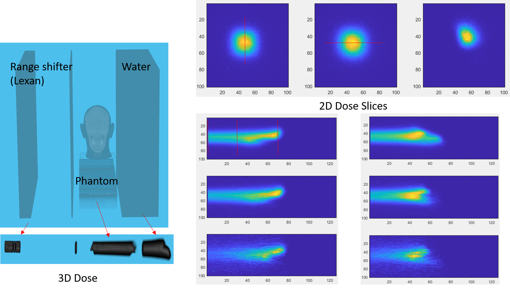
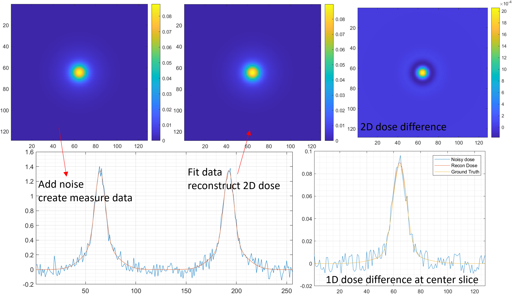
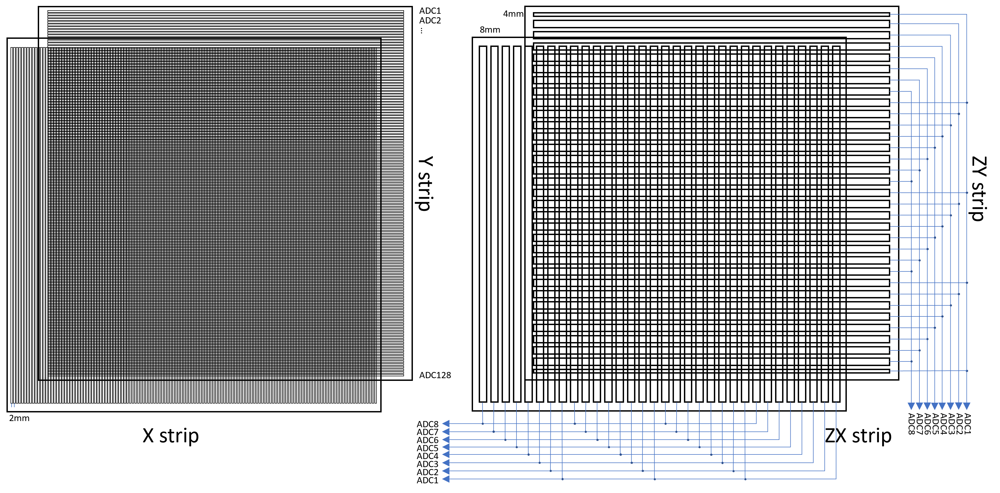
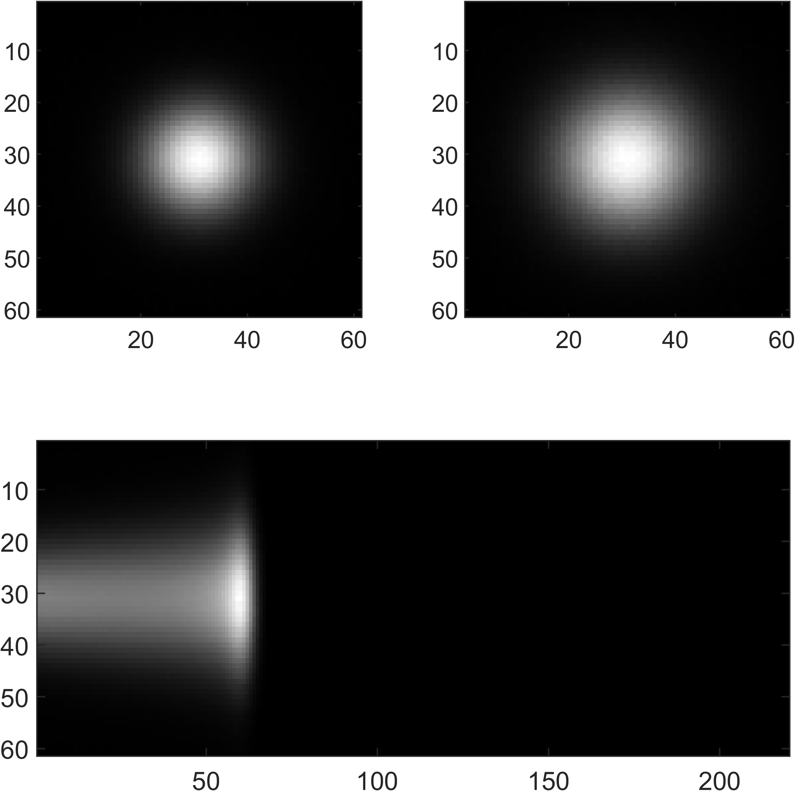

Formulas in this file maybe displayed as plain text online

TOPAS Simulation data `idds.mat` , proton energy at 20:1:227 MeV

<p align="center">

</p>

## 3D proton dose
1D IDD is good enough for energy verification, but for proton radiography and other QA purpose, a analytic 2D/3D dose distribution function could be usefull. In most case, double gauss model is accurate enough, I implemented multi-gauss model of two types, isotropic gaussian function($\sigma_x = \sigma_y$) and bivariate gaussian function.

A typical 3D scenario,like Mevion S250i, with range shifter, phantom and water tank(Detector), the proton beam is constrained in a square field.

<p align="center">

</p>

A good 3D function is required to fit the 3D dose. the xy dose can be modeled by a 2D gaussian based model(Double Gaussian, Gauss-Levy, or Double Gauss-Lorentz Cauchy etc[3]), and z dose is modeled by Bortfeld function(BF). In fact, the sigma of gaussian funciton is depend on depth z and it can be calculate directly from the area under the 2D Gauss function(One Gauss model), but it becomes complicate in multi-Gauss function. For simplicity's sake, sigma of Gauss function are treated as independent variables, this simplified function can be described by:

$$
\begin{align}
f(x,y,z) &= BF(z)*G(x,y)\\
f_{\bf X}(x,y) &= \frac{A}{2\pi\sqrt{|\Sigma|}} e^{-\frac{1}{2}\left((\textbf{X}-\mu)^T\Sigma^{-1}(\textbf{X}-\mu)\right)}
\end{align}
$$

The area(2D integral) of gauss function $\int\int f_{\bf X}(x,y;A=1) dxdy$ = 1. It's a very good property, that means the 2D dose function has area = A. Integral depth dose(IDD) at $z_0$ also give us the total dose of this 2D slice, therefore we have $BF(z_0) = A$.

The 3D dose function:

$$
\begin{align}
f(x,y,z) &= BF(z;R,\sigma,\epsilon,\Phi)*G(x,y;\mu,\Sigma)\\
 &= \frac{BF(z;R,\sigma,\epsilon,\Phi)}{2\pi\sqrt{|\Sigma|}} e^{-\frac{1}{2}\left((\textbf{X}-\mu)^T\Sigma^{-1}(\textbf{X}-\mu)\right)}\\
f(x,y,z) &= BF(z;R,\sigma,\epsilon,\Phi)*\sum_{i=1}^{N}G(x,y;\mu_i,\Sigma_i)\\
 &= BF(z;R,\sigma,\epsilon,\Phi)\sum_{i=1}^{N}\frac{a_i}{2\pi\sqrt{|\Sigma_i|}} e^{-\frac{1}{2}\left((\textbf{X}-\mu_i)^T\Sigma_{i}^{-1}(\textbf{X}-\mu_i)\right)}\\
 & \sum_{i=1}^N a_i = 1 \quad \forall a_i\in[0,1] 
\end{align}
$$

## 2D dose reconstruction

Strip ionization chamber array[4,5] were used for QA purpose, two layers of horizontal and vertical strip detectors were used to locate the proton beam position. With some pprior knowledge of the proton beam profile, it's feasible to reconstruct the 2D/3D dose from a limited number of measurements. Assume the xy resolution is 2mm, strip ionization chamber array usually has 128+128 ADC channels for x,y profile respectively. The measured data can be viewed as the 1D integral along the detector.
This forward and backward measure function can be defined as:
```matlab
function xy_meas = F(in) %forward
% in : 2D image, (128,128)
% xy_meas : (256,1)
x_measure = sum(in,1)';
y_measure = sum(in,2);
xy_meas = [x_measure;y_measure];
end
function img = Ft(xy_meas)%backward
% xy_meas : (256,1)
% img : 1D image, (128*128,1)
x_measure = xy_meas(1:128)';
y_measure = xy_meas(129:256);
img = repmat(x_measure,128,1) + repmat(y_measure,1,128);
img = img(:);
end
```

$$
\argmin_\theta \|F(G(X;\theta)) - m\|^2
$$


<p align="center">

</p>

<center>

| White Noise level(divide by max dose)      | Max Absolute Error( $\frac{\max\|error\|}{max[dose]}$) |
| ----------- | ----------- |
| 30%   |0.0441|
| 20%      | 0.0337      |
| 10%   | 0.0192        |

</center>

## 3D dose reconstruction
Only MLSIC can measure a 3D dose in real time[5], The basic structure is demonstrated as below: 
<p align="center">

</p>
The MLSIC compromise 2 high resolution(2mm) X strip and Y strip detectors(128+128) and extra 64 layers of low resolution(8mm) Z(X/Y) strip detectors(32*(8+8)). ZY strip detectors are shifted to achieve higher resolution. The effective FOV is 256mm by 256mm. The 3D dose (128*128*66)


For a simple 3D proton beam dose, 110MeV proton(TOPAS simulation data):

<p align="center">

</p>

Fitting 3D dose comprise 2 steps,
- Fitting 1D IDD curve
- Fitting 2D dose with gaussian functions layer by layer(or fit as a whole 3D dose)

Related function will be uploaded later.


### Benchmark
- It take 160s to fit 11057 IDD curves with 2 bragg peak model @i9-9900k
- It take 120s to fit 10498 IDD curves with 2 bragg peak model @i9-9900k

## Brief introduction of math
(formula will be displayed in github : https://github.com/civerjia/Proton-Bragg-Peak-Fit):

### 2D Gaussian

We model the covariance matrix of bivariate normal function by 6 parameters $a, \mu_1, \mu_2\sigma_1, \sigma_2, \beta$. The $\mu$ denotes the position, $\sigma$ denotes the standard deviation, and $\beta$ denotes the rotation of the coordinate. For convience, let $X = [x,y]^T$ and $\hat X = X - [\mu_1,\mu_2]^T$

$$
\begin{align}
\Sigma &= \begin{bmatrix}
\sigma_1^2 & 0\\
0 & \sigma_2^2
\end{bmatrix}\\
\Sigma^{-1} &= \frac{1}{\sigma_1^2 \sigma_2^2}\begin{bmatrix}
\sigma_2^2 & 0\\
0 & \sigma_1^2
\end{bmatrix}\\
R &= \begin{bmatrix}
cos\beta & -sin\beta\\
sin\beta & cos\beta
\end{bmatrix}\\
Y &= R\hat X  = \begin{bmatrix}
(x-\mu_1)cos\beta - (y-\mu_2)sin\beta\\
(x-\mu_1)sin\beta + (y-\mu_2)cos\beta
\end{bmatrix}
\\
S &= Y^T\Sigma^{-1}Y = \frac{\left[\cos (\beta ) \left(x-\mu _1\right)-\sin (\beta ) \left(y-\mu _2\right)\right]{}^2}{\sigma _1^2}+\\
&\frac{\left[\sin (\beta ) \left(x-\mu _1\right)+\cos (\beta ) \left(y-\mu _2\right)\right]{}^2}{\sigma _2^2}
\\
G(X) &= \frac{a_i}{2\pi\sigma_1\sigma_2} e^{-\frac{1}{2}Y^T\Sigma^{-1}Y}
\\
\end{align}
$$

#### Gradient of gauss
Formulas are double checked and compared with finite difference.

$$
\begin{align}
Y[1] &= (x-\mu_1)cos\beta - (y-\mu_2)sin\beta\\
Y[2] &= (x-\mu_1)sin\beta + (y-\mu_2)cos\beta\\
S[1] &= \frac{\left[\cos (\beta ) \left(x-\mu _1\right)-\sin (\beta ) \left(y-\mu _2\right)\right]{}^2}{\sigma _1^2}
\\
S[2] &= \frac{\left[\sin (\beta ) \left(x-\mu _1\right)+\cos (\beta ) \left(y-\mu _2\right)\right]{}^2}{\sigma _2^2}
\\
\frac{\partial G}{\partial a} &= \frac{G(X)}{a}
\\
\frac{\partial G}{\partial \mu_1} &= G(X)\left(\frac{Y[1]\cos (\beta ) }{\sigma_1^2}
+\frac{Y[2]\sin (\beta )}{\sigma_2^2} \right)
\\
\frac{\partial G}{\partial \mu_2} &= G(X)\left(- \frac{Y[1]\sin (\beta )}{\sigma_1^2} 
+\frac{Y[2]\cos (\beta )}{\sigma_2^2} \right)
\\
\frac{\partial G}{\partial \sigma_1} &= 
\frac{S[1]G(X)}{\sigma_1}
-\frac{G(X)}{\sigma_1}
\\
\frac{\partial G}{\partial \sigma_2} &= 
\frac{S[2]G(X)}{\sigma_2}
-\frac{G(X)}{\sigma_2}
\\
\frac{\partial G}{\partial \beta} &= G(X)Y[1]Y[2]\left[ 
\frac{ 1}{\sigma _1^2}-\frac{ 1}{\sigma _2^2}
\right]
\\
\end{align}
$$

### Double Gauss Cauchy-Lorentz function
Triple Gaussian function can fit the lateral dose profile well, but it's hard to learn the secondary tail dose. And it's not easy to identify the major gaussian function. Double Gauss Cauchy-Lorentz function provide a more realistic solution for proton lateral dose profile. Cauchy-Lorentz function can easily fit the tail dose without fancy tricks.

$$
\begin{align}
f(x;\theta) &= \frac{w_1}{\pi}\frac{b}{(x-\mu)^2+b^2} + \frac{w_{2}}{\sqrt{2\pi}\sigma_{2}}e^{-\frac{(x - \,\mu)^{2}}{2\sigma_{2}^{2}}} + \frac{w_{3}}{\sqrt{2\pi}\sigma_{3}}e^{-\frac{(x - \,\mu)^2}{2\sigma_{3}^{2}}}
\end{align}
$$

### Bortfeld function 

Bortfeld function[1] is an analytical approximation of the Bragg curve for therapeutic proton beams, given by

$$
\begin{align}
D(z) \approx 
\begin{cases}
\hat{D}(z) \quad z < R_0 - 10\sigma\\
D(z)  \quad R_0 - 10\sigma\le z\le R_0+5\sigma \\
0  \quad  otherwise
\end{cases}
\end{align}
$$

z denotes the depth in cm. there are 4 parameters in bortfeld funtion $R_0, \sigma, \epsilon, \Phi_0$ and we can guess a initial points from the table provided by bortfeld.
```
z = (1:64)*0.291; % depth in cm
[vmax,idx] = maxk(idd,k);
R0 = z(idx);% Range
alpha = 0.0022;
p = 1.77;
E0 = (R0./alpha).^(1/p);% estimated proton energy
sigma = sqrt((0.012.*R0.^0.935).^2 + (0.01.*E0).^2.*(alpha.*p.*E0.^(p-1)).^2);
epsilon = 1e-3;
Phi = zv.*zr.*epsilon;
```
or use the simple version
```
R0 = z(idx);% Range
sigma = 0.07*zr;
epsilon = 1e-3;
Phi = zv.*zr.*1e-2;
```
The depth-dose distribution in water is given by $\hat D_{H_2O}(z)$ and $D_{H_2O}(z)$:

$$
\begin{align}
\hat D_{H_2O}(z) &= \frac{\Phi_0}{1+0.012R_0}\left[17.93(R_0-z)^{-0.435}+\left(0.444+31.7\frac{\epsilon}{R_0}\right)(R_0-z)^{0.565} \right]\\
D_{H_2O}(z) &= \Phi_0\frac{e^{-\frac{(R_0-z)^2}{4\sigma^2}}\sigma^{0.565}}{1+0.012R_0} \left[11.26\frac{\mathfrak{D}(-0.565,-\frac{R_0-z}{\sigma})}{\sigma}+ \left(0.157+11.26\frac{\epsilon}{R_0}\right) \mathfrak{D}(-1.565,-\frac{R_0-z}{\sigma})\right]\\
\end{align}
$$

$\mathfrak{D}(a,x)$, is a [parabolic cylinder function](https://mathworld.wolfram.com/ParabolicCylinderFunction.html) defined in Eq.33 We can get $\mathfrak{D}(a,x)=\mathit{U}(-a-0.5,x)$, this function is defined in https://github.com/civerjia/Parabolic-Cylinder-Functions-C-

Parameters of a single bortfeld function is a 4-element 1d array, $[R_0,\sigma,\epsilon,\Phi_0]$,  n-bortfeld function is a $4n$ 1d array, $[R_1,\sigma_1,\epsilon_1,\Phi_1,R_2,\sigma_2,\epsilon_2,\Phi_2,\cdots,R_n,\sigma_n,\epsilon_n,\Phi_n]$ .

#### Gradients:

$$
\begin{align}
\frac{\partial\hat D}{\partial R_0} &= 
\frac{\Phi_0 \left(-\frac{31.7 \epsilon (R_0-z)^{0.565}}{R_0^2}+\frac{0.565 \left(\frac{31.7 \epsilon}{R_0}+0.444\right)}{(R_0-z)^{0.435}}-\frac{7.79955}{(R_0-z)^{1.435}}\right)}{0.012 R_0+1}\\
&-\frac{0.012 \Phi_0 \left(\left(\frac{31.7 \epsilon}{R_0}+0.444\right) (R_0-z)^{0.565}+\frac{17.93}{(R_0-z)^{0.435}}\right)}{(0.012 R_0+1)^2}\\
\frac{\partial\hat D}{\partial \epsilon} &= \frac{31.7 \Phi_0 (R_0-z)^{0.565}}{(0.012 R_0+1) R_0}\\
\frac{\partial D}{\partial \epsilon} &= 
\frac{11.26 \Phi_0 \sigma^{0.565} e^{-\frac{(R_0-z)^2}{4 \sigma^2}} f\left(\frac{z-R_0}{\sigma},-1.565\right)}{(0.012 R_0+1) R_0}\\
\frac{\partial D}{\partial \sigma} &=
\frac{\Phi_0 \sigma^{0.565} e^{-\frac{(R_0-z)^2}{4 \sigma^2}} \left(-\frac{(z-R_0) \left(\frac{11.26 \epsilon }{R_0}+0.157\right) f^{(1,0)}\left(\frac{z-R_0}{\sigma},-1.565\right)}{\sigma^2}-\frac{11.26 (z-R_0) f^{(1,0)}\left(\frac{z-R_0}{\sigma},-0.565\right)}{\sigma^3}-\frac{11.26 f\left(\frac{z-R_0}{\sigma},-0.565\right)}{\sigma^2}\right)}{0.012 R_0+1}\\
&+\frac{0.565 \Phi_0 e^{-\frac{(R_0-z)^2}{4 \sigma^2}} \left(\left(\frac{11.26 \epsilon }{R_0}+0.157\right) f\left(\frac{z-R_0}{\sigma},-1.565\right)+\frac{11.26 f\left(\frac{z-R_0}{\sigma},-0.565\right)}{\sigma}\right)}{(0.012 R_0+1) \sigma^{0.435}}\\
&+\frac{\Phi_0 (R_0-z)^2 e^{-\frac{(R_0-z)^2}{4 \sigma^2}} \left(\left(\frac{11.26 \epsilon }{R_0}+0.157\right) f\left(\frac{z-R_0}{\sigma},-1.565\right)+\frac{11.26 f\left(\frac{z-R_0}{\sigma},-0.565\right)}{\sigma}\right)}{2 (0.012 R_0+1) \sigma^{2.435}}
\end{align}
$$

continue

$$
\begin{align}
f\left(\frac{z-R_0}{\sigma},a\right) &=
\mathfrak{D}_{a}(\frac{z-R_0}{\sigma})\\
f^{(1,0)}\left(x,a\right) &= 
\frac{\partial \mathfrak{D}_{a}(x)}{\partial x}\\
\frac{\partial D}{\partial R_0} &=
\frac{\Phi_0 \sigma^{0.565} e^{-\frac{(R_0-z)^2}{4 \sigma^2}} \left(-\frac{11.26 f^{(1,0)}\left(\frac{z-R_0}{\sigma},-0.565\right)}{\sigma^2}-\frac{\left(\frac{11.26 \epsilon }{R_0}+0.157\right) f^{(1,0)}\left(\frac{z-R_0}{\sigma},-1.565\right)}{\sigma}-\frac{11.26 \epsilon  f\left(\frac{z-R_0}{\sigma},-1.565\right)}{R_0^2}\right)}{0.012 R_0+1}\\
&+\frac{0.012 (-1) \Phi_0 \sigma^{0.565} e^{-\frac{(R_0-z)^2}{4 \sigma^2}} \left(\left(\frac{11.26 \epsilon }{R_0}+0.157\right) f\left(\frac{z-R_0}{\sigma},-1.565\right)+\frac{11.26 f\left(\frac{z-R_0}{\sigma},-0.565\right)}{\sigma}\right)}{(0.012 R_0+1)^2}\\
&-\frac{\Phi_0 (R_0-z) e^{-\frac{(R_0-z)^2}{4 \sigma^2}} \left(\left(\frac{11.26 \epsilon }{R_0}+0.157\right) f\left(\frac{z-R_0}{\sigma},-1.565\right)+\frac{11.26 f\left(\frac{z-R_0}{\sigma},-0.565\right)}{\sigma}\right)}{2 (0.012 R_0+1) \sigma^{1.435}}
\end{align}
$$


Because parabolic cylinder funciton is slow to compute, I proposed a new approximation, this function can approximate PCF without iteration.It was modified from the asymptotic expansions.
reference 
1. I. S. Gradshteyn and I. M. Ryzhik,Table of Integrals, Series and Prod-ucts~Academic, San Diego, 1980 **page 1028**
2. Butler, Roland W., and Andrew TA Wood. "Laplace approximations for hypergeometric functions with matrix argument." The Annals of Statistics 30.4 (2002): 1155-1177.
   
$$
\begin{align}
D_{a}(z) &\approx 
\begin{cases}
\frac{\sqrt{2\pi}}{\Gamma(-a)}(-z)^{-p-1}e^{\frac{z^{2}}{4}}(1+ \frac{(a+1)(a+2)}{2z^{2}})\;\;&z <  -t_{1}\\
2^{\frac{a}{2}}e^{\frac{-z^{2}}{4}}\left(\frac{\sqrt{\pi}}{\Gamma(\frac{1-a}{2})}F_{1}\left(\frac{-a}{2},0.5,\frac{z^{2}}{2}\right)-         \frac{\sqrt{2\pi}z}{\Gamma(\frac{-a}{2})}F_{1}\left(\frac{1-a}{2},1.5,\frac{z^{2}}{2}\right)\right) \;\; &-t_{1}\le z \le t_{2} \\
z^{a}e^{\frac{-z^{2}}{4}}(1-\frac{a(a-1)}{4z^{2}}) \;\; &z>t_{2}\\
\end{cases}\\
\end{align}
$$

$F_{1}$ is confluent hypergeometry function(laplace approximation).

$$
\begin{align}
F_{1}(a,b,x) &\approx \frac{b^{b- \frac{1}{2}}}{\sqrt{\frac{y^{2}}{a}+ \frac{(1-y)^{2}}{b-a}}} (\frac{y}{a})^{a}(\frac{1-y}{b-a})^{b-a}e^{xy}\\
y &= \frac{2a}{b-x+\sqrt{(x-b)^{2}+4ax}}
\end{align}
$$

when $a=-1.565$ the optimal threshold are $t_{1}=1.4$ and $t_{2}=1.6$ 

when $a=-0.565$ the optimal threshold are $t_{1}=1.9$ and $t_{2}=1.8$ 
